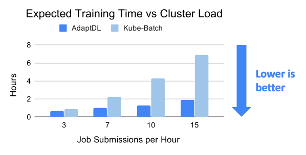
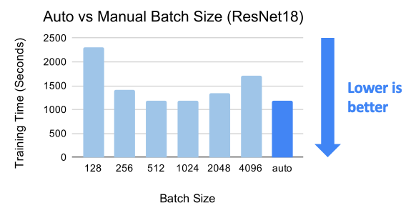

.. image:: https://img.shields.io/github/workflow/status/petuum/adaptdl/Test
  :target: https://github.com/petuum/adaptdl/actions?query=workflow%3ATest
  :alt: GitHub Workflow Status
.. image:: https://codecov.io/gh/petuum/adaptdl/branch/master/graph/badge.svg
  :target: https://codecov.io/gh/petuum/adaptdl
.. image:: https://readthedocs.org/projects/adaptdl/badge/?version=latest
  :target: https://adaptdl.readthedocs.io/en/latest/?badge=latest
  :alt: Documentation Status
.. image:: https://img.shields.io/pypi/v/adaptdl
  :target: https://pypi.org/project/adaptdl/
  :alt: PyPI

Introduction
------------

`Documentation <https://adaptdl.readthedocs.org>`_ |
`Examples <https://github.com/petuum/adaptdl/tree/master/examples>`_

.. include-start-after

AdaptDL is a *resource-adaptive* deep learning (DL) training and scheduling
framework. The goal of AdaptDL is to make distributed DL easy and efficient in
dynamic-resource environments such as shared clusters and the cloud.

Some core features offered by AdaptDL are:

*  Elastically schedule distributed DL training jobs in shared clusters.
*  Cost-aware resource auto-scaling in cloud computing environments (e.g. AWS).
*  Automatic batch size and learning rate scaling for distributed training.

AdaptDL supports PyTorch training programs. TensorFlow support coming soon!

Why AdaptDL?
------------

Efficient Resource Management
^^^^^^^^^^^^^^^^^^^^^^^^^^^^^

The AdaptDL scheduler directly optimizes cluster-wide training performance and
resource utilization, by using a genetic algorithm to periodically optimize
resource allocations for all jobs. Through elastic re-scaling, co-adapting
batch sizes and learning rates, and avoiding network interference, AdaptDL
significantly accelerates shared-cluster training when compared with alternative
schedulers. For details, please see our `technical paper
<https://arxiv.org/pdf/2008.12260.pdf>`_.

In the cloud (e.g. AWS), AdaptDL auto-scales the size of the cluster based on
how well those cluster resources are utilized. AdaptDL automatically
provisions spot instances when available to reduce cost by up to 80%.

Adaptive Batch Size Scaling
^^^^^^^^^^^^^^^^^^^^^^^^^^^

Efficient distributed training requires careful selection of the batch size and
learning rate, which can be tricky to find manually. AdaptDL offers automatic
batch size and learning rate scaling, which enables efficient distributed
training without requiring manual effort. To achieve this, AdaptDL measures the
system performance and `gradient noise scale <https://arxiv.org/pdf/1812.06162.pdf>`_
during training, adaptively selects the most efficient batch size, and scales
the learning rate using `AdaScale <https://arxiv.org/pdf/2007.05105.pdf>`_.

Easy-to-use Elastic API
^^^^^^^^^^^^^^^^^^^^^^^

Making training programs run elastically can be challenging and error-prone.
AdaptDL offers APIs which make it easy to enable elasticity for data-parallel
PyTorch programs. Simply change a few lines of code, without heavy refactoring!

**BEFORE:**

.. code-block:: python

   torch.distributed.init_process_group("nccl")
   model = torch.nn.parallel.DistributedDataParallel(model)
   dataloader = torch.utils.data.DataLoader(dataset, batch_size=128)
   for epoch in range(100):
       ...

**AFTER:**

.. code-block:: python

   adaptdl.torch.init_process_group("nccl")
   model = adaptdl.torch.AdaptiveDataParallel(model, optimizer)
   dataloader = adaptdl.torch.AdaptiveDataLoader(dataset, batch_size=128)
   for epoch in adaptdl.torch.remaining_epochs_until(100):
       ...

.. include-end-before

Getting Started
---------------

AdaptDL consists of a *Kubernetes job scheduler* and an *adaptive training
library*. They can be used in two ways:

1.  Scheduling multiple training jobs on a shared cluster or the cloud
    (`Scheduler Installation <https://adaptdl.readthedocs.io/en/latest/installation/index.html>`_).
2.  Adapting the batch size and learning rate for a single training job
    (`Standalone Training <https://adaptdl.readthedocs.io/en/latest/standalone-training.html>`_).

